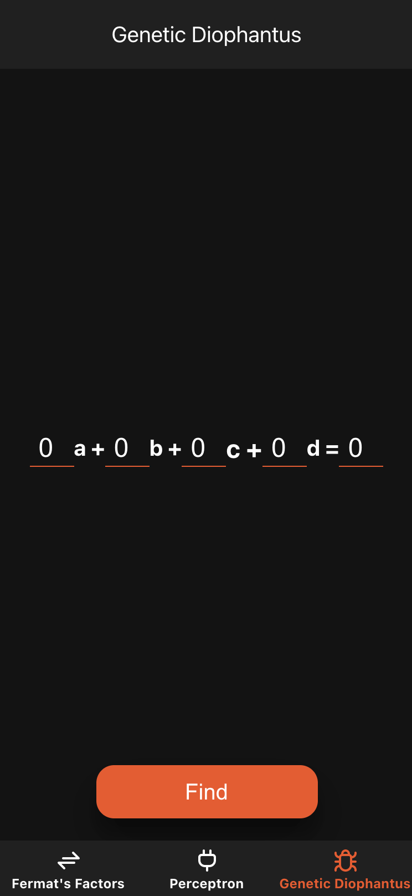
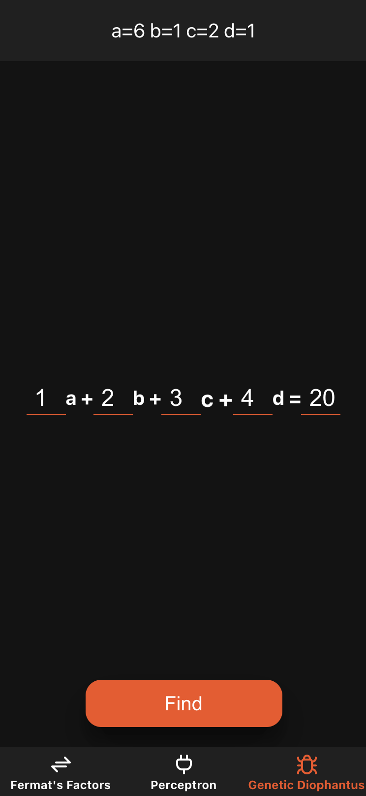
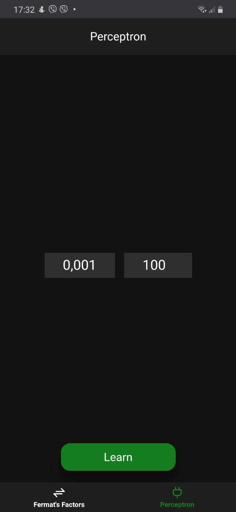
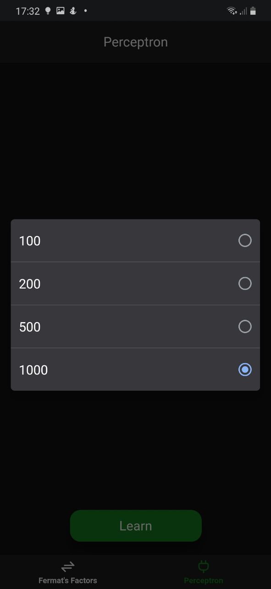
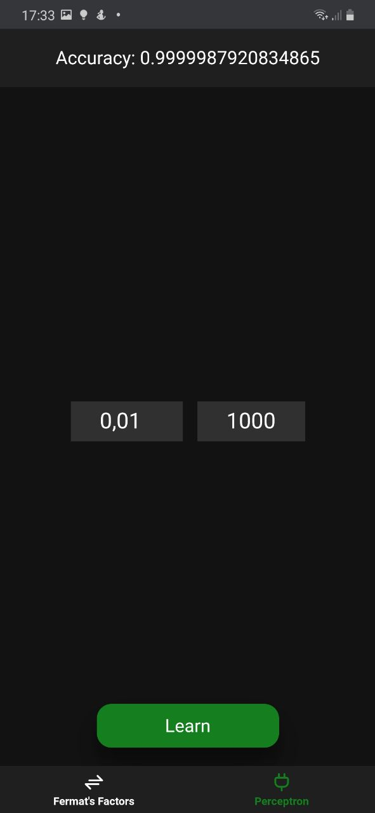
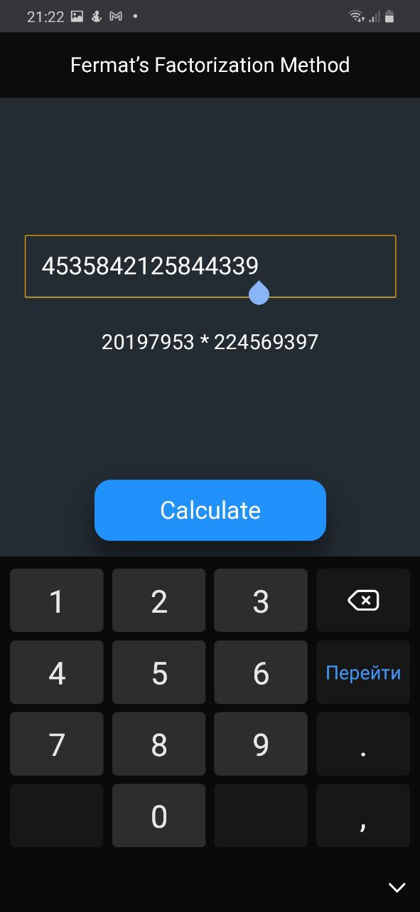
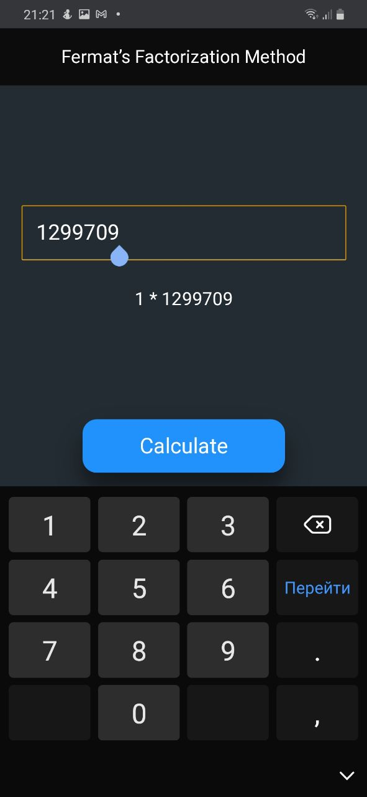
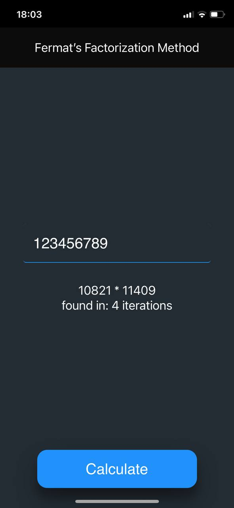

# RTS labs

<details>
  <summary><b>Lab 3</b> <i>"Generic Diophantus"</i></summary>

### Code

```typescript
const random = (min: number, max: number): number =>
    ~~(Math.random() * (max - min) + min)

class Chromosome {
    public genes: number[] = []
    public fitness: number = Infinity

    protected task: number[] = []
    protected target: number = 0

    private calc = () =>
        this.genes.reduce((a, gene, i) => a + (gene * this.task[i]))

    constructor(opts: {
        genes: number[],
        task: number[],
        target: number
    }) {
        Object.assign(this, opts);
        this.calcFitness()
    }

    public crossover(partner: Chromosome): Chromosome {
        const child = this.clone()

        const fromParent = child.genes.length / 2
        child.genes = [...child.genes.slice(0, fromParent), ...partner.genes.slice(child.genes.length - fromParent)]

        child.calcFitness()

        return child
    }

    private calcFitness() {
        this.fitness = Math.abs(this.target - this.calc())
    }

    private clone(): Chromosome {
        return Object.assign(Object.create(Object.getPrototypeOf(this)), this);
    }
}

class GeneticDiophantus {
    public population: Chromosome[] = []

    constructor({task, target}: { task: number[], target: number }) {
        const {length} = task
        this.population =
            Array.from(
                {length},
                () => new Chromosome({
                    genes: Array.from({length}, () => random(1, target / 2)),
                    task: task,
                    target: target,
                })
            )
    }

    public solve() {
        while (true) {
            const chromosome = this.crossover()
            if (chromosome)
                return chromosome.genes
        }
    }

    private crossover() {
        const children: Chromosome[] = []
        for (let i = 0; i < this.population.length; i++) {
            const parents = this.population
                .map((chromosome) => ({chromosome, probability: Math.random() * (chromosome.fitness * 1000)}))
                .sort((a, b) => a.probability - b.probability)

            const parent = parents[0].chromosome
            const partner = parents[1].chromosome

            const child = parent.crossover(partner)

            if (child.fitness === 0)
                return child

            children.push(child)
        }

        this.population = children
    }
}
```

### Screenshots





</details>

<details>
  <summary><b>Lab 2</b> <i>"Perceptron"</i></summary>

### Code

```typescript
type Input = number[]

const activations = {
    default: (x: number): number => x,
    ReLu: (x: number): number => Math.max(0, x),
    Sigmoid: (x: number): number => 1 / (1 + Math.exp(-x)),
}

class Perceptron {
    public weights: number[] = [0, 0]
    public accuracy: number = 0

    protected threshold: number = 1
    protected learningRate: number = .1

    private activation = activations.default
    private bias: number = 1

    private error = 1 / 1e6

    constructor(opts: {
        threshold?: number,
        learningRate?: number,
    }) {
        Object.assign(this, opts);
    }

    public guess(point: Input): boolean {
        return this.predict(point) > this.threshold
    }

    public predict(point: Input): number {
        return this.activation(this.sum(point))
    }

    public train(points: Input[]): boolean {
        let success = true
        points.forEach((point, i) => {
            success = this.adjustWeights(point, i) && success
        })

        return success
    }

    public learn(points: Input[], deadline: number = 100) {
        while (true) {
            if (deadline / points.length <= 0 || this.train(points))
                break;
            deadline--
        }

        return this.accuracy
    }

    private adjustWeights(point: Input, i: number): boolean {
        const delta = this.delta(this.predict(point));

        if (Math.abs(delta) < this.error || delta * Math.pow(-1, i) < 0)
            return true

        this.weights =
            this.weights.map((w, i) => {
                return w + delta * point[i] * this.learningRate

            });

        this.accuracy = 1 - delta

        return false
    }

    private sum(point: Input): number {
        return point.reduce((sum, x, i) => sum + x * this.weights[i], 0) + this.bias
    }

    private delta(y: number): number {
        return this.threshold - y
    }
}
```

### Screenshots







</details> 

<details>
  <summary><b>Lab 1</b> <i>"Fermat's Factors"</i></summary>

### Code

```typescript
function fermatFactors(n: number): number[] {
    if (n <= 0)
        return [n]

    if (!(n % 2))
        return [n / 2, 2]

    let a = Math.ceil(Math.sqrt(n))

    if (a * a === n)
        return [a, a]

    let b = 0
    while (1) {
        const c = a * a - n
        b = Math.floor(Math.sqrt(c))

        if (b * b === c)
            break
        else
            a += 1
    }

    return [a - b, a + b]
}
```

### Screenshots







</details> 
